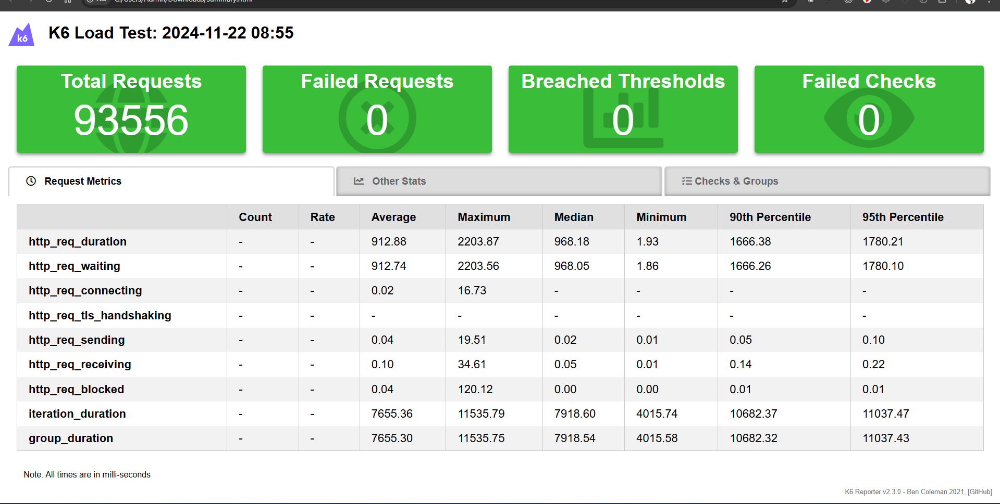
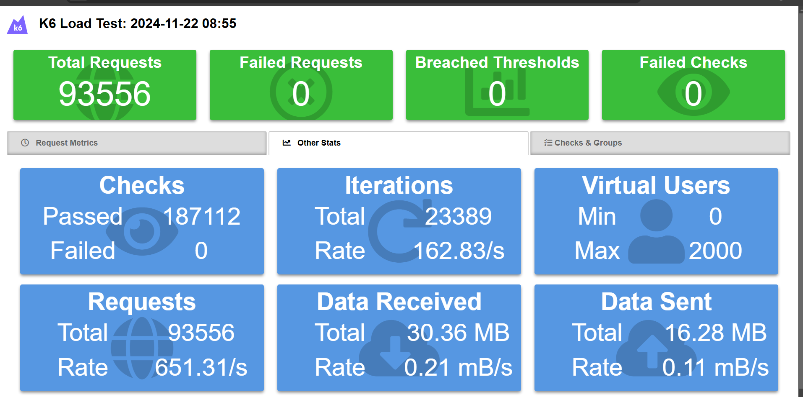
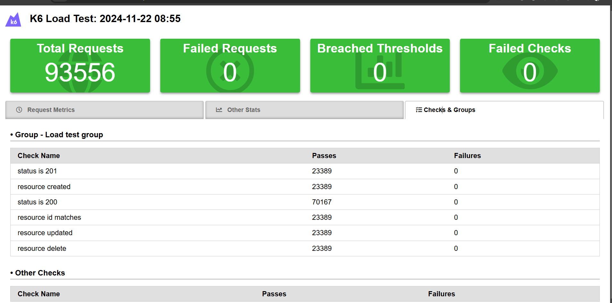
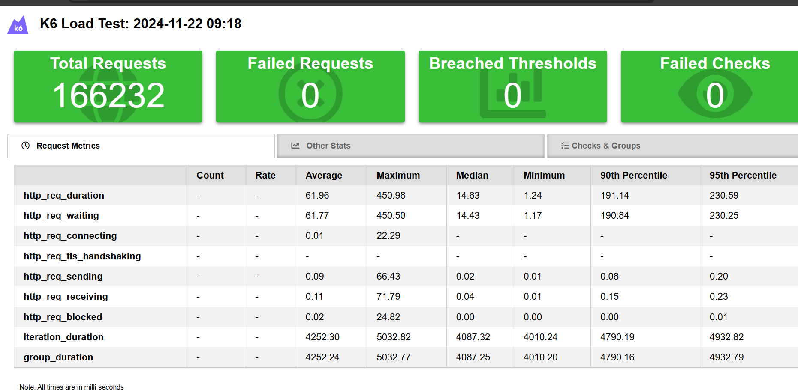
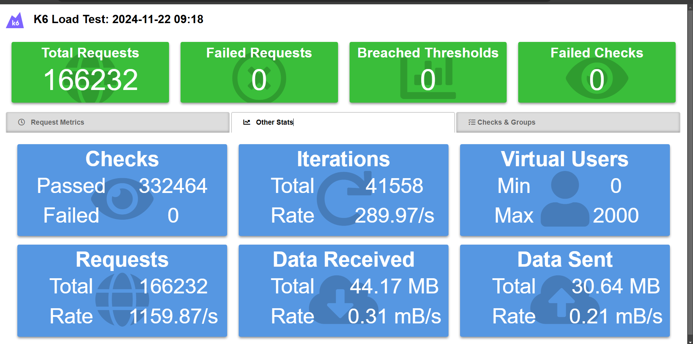
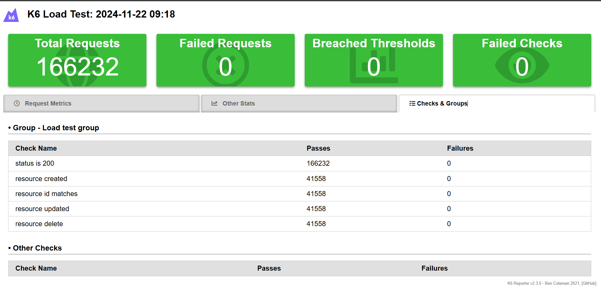

# Project-open-source-k6-grafana

- Video demo: [https://drive.google.com/drive/folders/1Dq2LE5olXcymAYH6fK7vsZa4iHk-G_QY]

- File kết quả của test: [./report]

- Công cụ test: k6: k6 là công cụ mã nguồn mở giúp thử nghiệm hiệu suất và khả năng chịu tải của website, nó cho phép bạn tạo ra các kịch bản thử nghiệm mô phỏng lưu lượng người dùng và đo lường hiệu suất của ứng dụng web của bạn trong diều kiện tải lớn
-  k6: tạo ra các kịch bản thử nghiệm rồi chạy chúng, ta có thể đo lường thời gian phản hồi của máy chủ rồi số lượng yêu cầu thành công và thất bại và nhiều cách thứ đo hiệu suất khác

Kết quả test nodejs: 

    

Kết quả test bun:

Giải thích thông số:

- `http_req_blocked`: thời gian mà yêu cầu http bị chặn có thể là do đợi tài nguyên từ server hoặc do đợi mạng, ý nghĩa của chỉ số này là cho biết thời gian yêu cầu phải chờ đợi trước khi bắt đầu được xử lý, thì chỉ số này có thể phản ánh vấn đề về tài nguyên hoặc hoặc phần tải mạng

- `http_req_connecting`: thời gian máy khác mất để kết nối tới với máy chủ sau khi đã gửi yêu cầu, đó tức là từ client đến server thì ý nghĩa ở đây là thời gian này sẽ bao gồm việc thiết lập kết nối tcp với máy chủ, nếu mà thời gian này quá cao có thể gây ra những vấn đề mạng (thời gian 
kết nối tới máy chủ)

- `http_req_duration`: chính xác là thời gian chung của các yêu cầu http bao gồm cả các giai đoạn trước và sau khi gửi yêu cầu, thì ý nghĩa của nó là thời gian tổng cộng để hoàn thành một yêu cầu http tức là cả quá trình gửi và nhận khi mà hoàn thành xong đó được gọi là một req_duration

- `http_req_failed`: tỉ lệ request bị faild

- `http_req_receiving`: thời gian để nhận dữ liệu từ máy chủ và nó thể hiện cho thấy tốc độ máy chủ gửi dữ liệu về cho máy khách, nếu mà thời gian nhận dữ liệu quá lâu có thể thấy máy chủ đang gặp vấn đề hoặc đường truyền mạng không ổn định (chỉ số đánh giá máy chủ và đường truyền)

- `http_req_sending`: thời gian để gửi dữ liệu lên máy chủ và chỉ số này cho thấy rằng tốc độ gửi dữ liệu từ máy khách lên đến server

- `http_req_tls_handshaking`: thời gian để thiết lập kết nối an toàn và chính xác là ssl, website hiện tại not secure, còn ssl thì có thêm s

- `http_req_waiting`: thời gian chờ phản hồi từ máy chủ sau khi gửi yêu cầu, tức là sau khi client gửi yêu cầu đến máy chủ thì đây chính xác là khoảng thời gian chờ máy chủ phản hồi về

- `p(90)`: thời gian 90% các yêu cầu bị chặn dưới giá trị này, có nghĩa là thấp hơn 10% giá trị yêu cầu còn lại và 772.16 mmicro giây thì xử lý rất hiệu quả rồi
- `p(95)`: tương tự thôi nhưng với con số  12.04ms đánh giá là mức dộ chấp nhận được và nó chỉ thể hiện một số lượng nhỏ các yêu cầu có thời gian chờ hơi lâu

